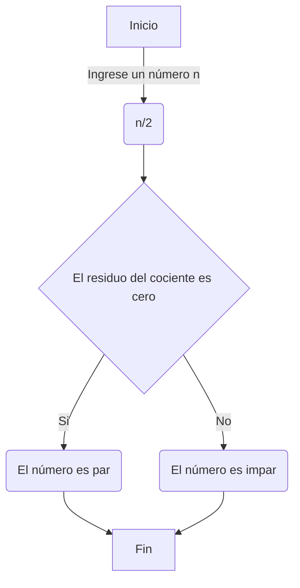

# Taller 1
<table cellspacing="1" bgcolor="" align="center">
  <tr bgcolor="#252582">
    <th><b>Taller 1 - Parte 1</b></th>
  </tr>
  <tr bgcolor="#e4e4ed">
    <td style="color:#141414" align="center">Realice el quiz Python Beginner Quiz (20 preguntas) y adjunte pantallazo con el resultado (mínimo 90% bien).</td>
  </tr>
</table>

[](https://postimg.cc/SYkdJ5g3)

<table cellspacing="1" bgcolor="" align="center">
  <tr bgcolor="#252582">
    <th><b>Taller 1 - Parte 2</b></th>
  </tr>
  <tr bgcolor="#e4e4ed">
    <td style="color:#141414" align="center">Realice un programa que lea tres números reales y determine cuál es el mayor.</td>
  </tr>
  <tr bgcolor="#e4e4ed">
    <td style="color:#141414" align="center">Para este ejercicio, empleo diferentes desigualdades que me permiten conocer poco a poco cuál de los tres números reales es mayor.</td>
  </tr>
</table>

**Parte 2**
```python
#Taller 1 - Punto 2
#Realice un programa que lea tres números reales y determine cuál es el mayor.

def introducir():
    num1 = int(input("Ingrese el primer número. Ejemplo: 1.5: "))
    num2 = int(input("Ingrese el primer número. Ejemplo: 2: "))
    num3 = int(input("Ingrese el primer número. Ejemplo: 3.75: "))
    desarrollo(num1,num2,num3)

def desarrollo(num1,num2,num3):
    if num1>num2:
        if num1>num3:
            print(f"El {num1} es el número mayor.")            
            return
        else:
            print(f"El {num3} es el número mayor.")            
            return
    elif num2>num1:
        if num2>num3:
            print(f"El {num2} es el número mayor.")            
            return
        else:
            print(f"El {num3} es el número mayor.")            
            return
    else:
            print(f"El {num3} es el número mayor.")            
            return


def continuar():
    opcion = int(input("¿Desea continuar? Marque 1 (sí) o 2 (no): "))
    return opcion

print("Ingrese tres números reales para determinar cuál es el número mayor.")

while True:
    introducir()
    opcion = continuar()
    if opcion == 2:
        break

# ! /\|=\/
```

<table cellspacing="1" bgcolor="" align="center">
  <tr bgcolor="#252582">
    <th><b>Taller 1 - Parte 3</b></th>
  </tr>
  <tr bgcolor="#e4e4ed">
    <td style="color:#141414" align="center">Realice un programa que lea un número enteros y determine si es par o impar.</td>
  </tr>
  <tr bgcolor="#e4e4ed">
    <td style="color:#141414" align="center">En esta ocasión, se hace uso del operador del módulo, quien calcula el residuo de la división.</td>
  </tr>
</table>



**Parte 3**
```python
#Taller 1 - Punto 3
#Realice un programa que lea un número entero y determine si es par o impar.

def introducir():
    num1 = int(input("Ingrese el primer número entero. Ejemplo: 5: "))
    desarrollo(num1)

def desarrollo(num1):
    if num1 %2:
        print(f"El número {num1} es impar.")
        return
    else:
        print(f"El número {num1} es par")
        return


def continuar():
    opcion = int(input("¿Desea continuar? Marque 1 (sí) o 2 (no): "))
    return opcion

print("Ingrese un número entero para determinar si par o impar.")

while True:
    introducir()
    opcion = continuar()
    if opcion == 2:
        break
# ! /\|=\/
```

<table cellspacing="1" bgcolor="" align="center">
  <tr bgcolor="#252582">
    <th><b>Taller 1 - Parte 4</b></th>
  </tr>
  <tr bgcolor="#e4e4ed">
    <td style="color:#141414" align="center">Realice un programa que lea dos números reales y determine si el primero es múltiplo del segundo.</td>
  </tr>
  <tr bgcolor="#e4e4ed">
    <td style="color:#141414" align="center">Para este punto, se comprueba que el primer número no es 0, para después continuar con el uso del operador del número para calcular el residuo de la división del primer número por el segundo, puesto que si el residuo de <i>num1 / num2</i> no es cero, entonces <i>num1</i> no es múltiplo de <i>num2</i>.</td>
  </tr>
</table>

**Parte 4**
```python
#Taller 1 - Punto 4
#Realice un programa que lea dos números reales y determine si el primero es múltiplo del segundo.
def introducir():
    num1 = float(input("Ingrese el primer número: "))
    num2 = float(input("Ingrese el segundo número: "))
    desarrollo(num1,num2)

def desarrollo(num1,num2):
    if num2!= 0 and num1 % num2 == 0:
        print(f"{num1} es múltiplo de {num2}.")
        return
    else:
        print(f"{num1} no es múltiplo de {num2}.")
        return

def continuar():
    opcion = int(input("¿Desea continuar? Marque 1 (sí) o 2 (no): "))
    return opcion

print("Ingrese dos números reales para derminar si el primero es múltiplo del segundo.")

while True:
    introducir()
    opcion = continuar()
    if opcion == 2:
        break

# ! /\|=\/
```

<table cellspacing="1" bgcolor="" align="center">
  <tr bgcolor="#252582">
    <th><b>Taller 1 - Parte 5</b></th>
  </tr>
  <tr bgcolor="#e4e4ed">
    <td style="color:#141414" align="center">Realice un programa que lea tres números reales y determine si la suma de los dos primeros es mayor, menor o igual que el tercer número.</td>
  </tr>
  <tr bgcolor="#e4e4ed">
    <td style="color:#141414" align="center">Para el quinto punto del taller, se emplean diferentes desigualdades en las que se tiene en que se tiene en cuenta el orden en que se ingresan los datos.</td>
  </tr>
</table>

**Parte 5** 
```python
#Taller 1 - Punto 5
#Realice un programa que lea tres números reales y determine si la suma de los dos primeros es mayor, menor o igual que el tercer número.

def introducir():
    num1 = float(input("Ingrese el primer número. Ejemplo: 5.6: "))
    num2 = float(input("Ingrese el segundo número. Ejemplo: 10: "))
    num3 = float(input("Ingrese el tercer número. Ejemplo: 8.75: "))
    desarrollo(num1,num2,num3)

def desarrollo(num1,num2,num3):
    if num1+num2>num3:
        print(f"La suma de los números {num1} y {num2} es mayor que {num3}")
        return
    elif num1+num2==num3:
        print(f"La suma de los números {num1} y {num2} es igual al número {num3}")
        return
    else:
        print(f"La suma de los números {num1} y {num2} es menor que {num3}")
        return

def continuar():
    opcion = int(input("¿Desea continuar? Marque 1 (sí) o 2 (no): "))
    return opcion

print("Ingrese tres números para determinar si la suma de los dos primeros números es mayor, menor o igual al tercer número.")

while True:
    introducir()
    opcion = continuar()
    if opcion == 2:
        break

# ! /\|=\/
```

<table cellspacing="1" bgcolor="" align="center">
  <tr bgcolor="#252582">
    <th><b>Taller 1 - Parte 6</b></th>
  </tr>
  <tr bgcolor="#e4e4ed">
    <td style="color:#141414" align="center">Escriba un programa que solicite al usuario una letra y determine si es una vocal o una consonante.</td>
  </tr>
  <tr bgcolor="#e4e4ed">
    <td style="color:#141414" align="center">Para este ejercicio, se parte de la lista de vocales y luego se hace uso de condicionales para determinar si la letra está dentro de esa lista o no, en caso de no estarlo sería una consonante.</td>
  </tr>
</table>

**Parte 6** 
```python
#Taller 1 - Punto 6
#Escriba un programa que solicite al usuario una letra y determine si es una vocal o una consonante.
def introducir():
    letra = input("Ingrese una letra: ").lower()
    desarrollo(letra)

def desarrollo(letra):
    vocales = ["a","e","i","o","u"]
    if letra in vocales:
        print(f"La letra {letra} es una vocal.")
        return
    else:
        print(f"La letra {letra} es una consonante.")
        return

def continuar():
    opcion = int(input("¿Desea continuar? Marque 1 (sí) o 2 (no): "))
    return opcion

print("Ingrese una letra para conocer si es una vocal o una consonante")

while True:
    introducir()
    opcion = continuar()
    if opcion == 2:
        break

# ! /\|=\/
```

<table cellspacing="1" bgcolor="" align="center">
  <tr bgcolor="#252582">
    <th><b>Taller 1 - Parte 7</b></th>
  </tr>
  <tr bgcolor="#e4e4ed">
  <td style="color:#141414" align="center">Escriba un programa que pida 5 números reales y calcule las siguientes operaciones:
        <li>El promedio</li>
        <li>La mediana</li>
        <li>El promedio multiplicativo </li>
        <li>Ordenar los números de forma ascendente</li>
        <li>Ordenar los números de forma descendente</li>
        <li>La potencia del mayor número elevado al menor número</li>
        <li>La raíz cúbica del menor número</li>
   </td>
  </tr>
  <tr bgcolor="#e4e4ed">
    <td style="color:#141414" align="center">Para este punto, primero se ordenan los números de forma ascendente en una lista, a partir de ahí se van ejecutando las operaciones correspondientes.</td>
  </tr>
</table>

**Parte 7** 
```python
#Taller 1 - Punto 7
#Escriba un programa que pida 5 números reales y calcule las siguientes operaciones: 
#Promedio, mediana, promedio multiplicativo, ordenar los números de forma ascendente, ordenar los números de forma descendente, potencia del mayor número elevado al menor número, raíz cúbica del menor número.

def introducir():
    num1 = float(input("Ingrese el primer número. Ejemplo: 50.75: "))
    num2 = float(input("Ingrese el segundo número. Ejemplo: 50.75: "))
    num3 = float(input("Ingrese el tercer número. Ejemplo: 50.75: "))
    num4 = float(input("Ingrese el cuarto número. Ejemplo: 50.75: "))
    num5 = float(input("Ingrese el quinto número. Ejemplo: 50.75: "))
    desarrollo(num1,num2,num3,num4,num5)

def desarrollo(num1,num2,num3,num4,num5):
    numeros = [num1,num2,num3,num4,num5]
    numeros.sort()

    promedio = (num1+num2+num3+num4+num5)/5
    print(f"Promedio: {promedio}")

    if len(numeros) % 2 == 0:
        mediana = (numeros[len(numeros)//2-1] + numeros[len(numeros)//2])/2
    else:
        mediana = numeros[len(numeros)//2]
    print(f"Mediana: {mediana}")

    promedio_multiplicativo = (num1*num2*num3*num4*num5)/5
    print(f"Promedio multiplicativo: {promedio_multiplicativo}")

    print(f"Números de forma ascendente: {numeros}")

    numeros.sort(reverse=True)
    print(f"Números de forma descendente: {numeros}")

    potencia = numeros[0]**numeros[-1]
    print(f"potencia del mayor número elevado al menor número: {potencia}")

    raiz = num1 ** (1/3)
    print(f"La raiz cúbica del número menor: {raiz}")

def continuar():
    opcion = int(input("¿Desea continuar? Marque 1 (sí) o 2 (no): "))
    return opcion

print("Ingrese cinco número para realizar determinadas operaciones.")

while True:
    introducir()
    opcion = continuar()
    if opcion == 2:
        break

# ! /\|=\/
```

<table cellspacing="1" bgcolor="" align="center">
  <tr bgcolor="#252582">
    <th><b>Taller 1 - Parte 8</b></th>
  </tr>
  <tr bgcolor="#e4e4ed">
    <td style="color:#141414" align="center">Escriba un programa al que se le ingrese la frecuencia de una onda en hz y como salida arroje en que parte del espectro electromagnético se encuentra.</td>
  </tr>
  <tr bgcolor="#e4e4ed">
    <td style="color:#141414" align="center">En esta ocasión, se investigó sobre el espectro electromagnético para después generar desigualdades que permitan determinar en qué parte del espectro electromagnético se encuentra la onda.</td>
  </tr>
</table>

**Parte 8** 
```python
#Taller 1 - Punto 8
#Escriba un programa al que se le ingrese la frecuencia de una onda en hz y como salida arroje en que parte del espectro electromagnético se encuentra.

def introducir():
    frecuencia = float(input("Ingrese la frcuencia de una onda (en hz). Ejemplo: 50.75: "))
    desarrollo(frecuencia)
    parte_espectro = desarrollo(frecuencia)
    print(f"La frecuencia de onda {frecuencia} HZ se encuentra en la parte del espectro electromagnético {parte_espectro}")

def desarrollo(frecuencia):
    if frecuencia <3e9:
        return "Radiofrecuencia (RF)"
    elif 3e9 <= frecuencia < 3e11:
        return "Microondas"
    elif 3e11 <= frecuencia < 4e14:
        return "Infrarojo (IR)"
    elif 4e14 <= frecuencia < 7.9e14:
        return "Luz visible"
    elif 7.9e14 <= frecuencia < 3e17:
        return "Ultravioleta (UV)"
    elif 3e17 <= frecuencia < 3e19:
        return "Rayos X"
    else:
        return "Rayos Gamma"

def continuar():
    opcion = int(input("¿Desea continuar? Marque 1 (sí) o 2 (no): "))
    return opcion

print("Ingrese la frecuencia en hz de una onda para determinar en qué parte del espectro electromagnético se encuentra.")


while True:
    introducir()
    opcion = continuar()
    if opcion == 2:
        break

# ! /\|=\/
```

<table cellspacing="1" bgcolor="" align="center">
  <tr bgcolor="#252582">
    <th><b>Taller 1 - Parte 9</b></th>
  </tr>
  <tr bgcolor="#e4e4ed">
    <td style="color:#141414" align="center">Escriba un programa que reciba el nombre en minúsculas de un país de America y retorne la ciudad capital, si el país no pertenece al continente debe arrojar país no identificado.</td>
  </tr>
  <tr bgcolor="#e4e4ed">
    <td style="color:#141414" align="center">Ahora, en el noveno punto del taller, se indagó sobre las capitales de todos los países de América y se creó un diccionario, para después solo incluir las condiciones del punto.</td>
  </tr>
</table>

**Parte 9** 
```python
#Taller 1 - Punto 9
#Escriba un programa que reciba el nombre en minúsculas de un país de America y retorne la ciudad capital, si el país no pertenece al continente debe arrojar país no identificado.

def introducir():
    pais = input("Ingrese el nombre de un país. Ejemplo: Colombia: ").lower()
    desarrollo(pais)
    return pais

def desarrollo(pais):
    paises_america = {
    "canadá": "Ottawa",
    "estados unidos": "Washington D.C.",
    "méxico": "Ciudad de México",
    "belice": "Belmopán",
    "costa rica": "San José",
    "el salvador": "San Salvador",
    "guatemala": "Ciudad de Guatemala",
    "honduras": "Tegucigalpa",
    "nicaragua": "Managua",
    "panamá": "Ciudad de Panamá",
    "argentina": "Buenos Aires",
    "bolivia": "La Paz",
    "brasil": "Brasilia",
    "chile": "Santiago",
    "colombia": "Bogotá",
    "ecuador": "Quito",
    "paraguay": "Asunción",
    "perú": "Lima",
    "surinam": "Paramaribo",
    "trinidad y tobago": "Puerto España",
    "uruguay": "Montevideo",
    "venezuela": "Caracas",
    "antiguas y barbuda": "Saint John's",
    "bahamas": "Nasáu",
    "barbados": "Bridgetown",
    "cuba": "La Habana",
    "dominica": "Roseau",
    "granada": "San Jorge",
    "guyana": "Georgetown",
    "haití": "Puerto Príncipe",
    "jamaica": "Kingston",
    "república dominicana": "Santo Domingo",
    "san cristóbal y nieves": "Basseterre",
    "san vicente y las granadinas": "Kingstown",
    "santa lucía": "Castries"
    }
    if pais in paises_america:
        return paises_america[pais]
    else:
        return "Paí no identificado"
    
def continuar(pais):
    capital = desarrollo(pais)
    print(f"La capital de {pais.capitalize()} es: {capital}")
    opcion = int(input("¿Desea continuar? Marque 1 (sí) o 2 (no): "))
    return opcion

print("Programa para conocer la capital de un país de América")

while True:
    pais = introducir()
    opcion = continuar(pais)
    if opcion == 2:
        break
# ! /\|=\/
```

<table cellspacing="1" bgcolor="" align="center">
  <tr bgcolor="#252582">
    <th><b>Taller 1 - Parte 10</b></th>
  </tr>
  <tr bgcolor="#e4e4ed">
    <td style="color:#141414" align="center">Escriba un programa que dada una distancia calcule:
        <li>El tiempo que le tomaría a la luz recorrer la distancia.</li>
        <li>El tiempo que le tomaría al sonido (en el aire) recorrer la distancia.</li>
        <li>El tiempo que le tomaría al vehiculo comercial más veloz recorrer la distancia.</li>
        <li>El tiempo que le tomaría a Bolt recorrer la distancia.</li>
    </td>
  </tr>
  <tr bgcolor="#e4e4ed">
    <td style="color:#141414" align="center">Para finalizar con el taller, en este ejercicio se exploró sobre las distintas velocidades requeridas por el punto, de tal modo aplicar la formula <i>t=d/v</i></td>
  </tr>
</table>


**Parte 10** 
```python
#Taller 1 - Punto 10
#Escriba un programa que dada una distancia calcule:
#El tiempo que le tomaría a la luz recorrer la distancia, el tiempo que le tomaría al sonido (en el aire) recorrer la distancia, el tiempo que le tomaría al vehiculo comercial más veloz recorrer la distancia, el tiempo que le tomaría a Bolt recorrer la distancia.
def introducir():
    distancia = float(input("Ingrese una distancia en metros. Ejemplo: 5: "))
    desarrollo(distancia)
    return distancia

def desarrollo(distancia):
    tiempo1 = distancia/2.998e+8
    print(f"El tiempo que tarda la luz en recorrer {distancia} metros en el vacio es de: {tiempo1} segundos.")

    tiempo2 = distancia/343
    print(f"El tiempo que tarda el sonido en recorrer {distancia} metros en el aire (20°C) es de: {tiempo2} segundos.")

    tiempo3 = distancia/136.2444
    print(f"El tiempo que tarda el Bugatti Vhiron Super Sport 300+ en recorrer {distancia} metros en el aire es de: {tiempo3} segundos.")

    tiempo4 = distancia/11.666
    print(f"El tiempo que tarda Bolt en recorrer {distancia} metros en el aire es de: {tiempo4} segundos.")
    return
    
def continuar():
    opcion = int(input("¿Desea continuar? Marque 1 (sí) o 2 (no): "))
    return opcion

print("Programa para conocer la capital de un país de América")

while True:
    pais = introducir()
    opcion = continuar()
    if opcion == 2:
        break

# ! /\|=\/
```

<h2>Bibliografía</h2>
    <div class="bibliografia">
        <table>
            <tr>
                <th>Referencia</th>
            </tr>
            <tr>
                <td>Car and Driver. (2024, febrero 26). Los 20 coches más rápidos del mundo y su velocidad máxima. Recuperado de https://www.caranddriver.com/es/coches/planeta-motor/g38887240/coches-mas-rapidos-mundo/<a href="https://www.caranddriver.com/es/coches/planeta-motor/g38887240/coches-mas-rapidos-mundo/"></a></td>
            </tr>
            <tr>
                <td>Women's Health. (2024, febrero 19). ¿A qué ritmo deberíamos comenzar a correr para lograr después una gran velocidad? Recuperado de https://www.womenshealthmag.com/es/fitness/a2000480/velocidad-corren-humanos/<a href="https://www.womenshealthmag.com/es/fitness/a2000480/velocidad-corren-humanos/"></a></td>
            </tr> 
          <tr>
                <td>Pythonspot. (2023, noviembre 26). Python Tests / Quizes. Recuperado de https://pythonspot.com/python-tests-quizes/<a href="https://pythonspot.com/python-tests-quizes/"></a></td>
            </tr> 
          <tr>
                <td>Mundo Deportivo. (s.f.). Lista de países y capitales de América. Recuperado de https://www.mundodeportivo.com/uncomo/educacion/articulo/lista-de-paises-y-capitales-de-america-42870.html<a href="https://www.mundodeportivo.com/uncomo/educacion/articulo/lista-de-paises-y-capitales-de-america-42870.html"></a></td>
          </tr>
          <tr>
                <td>Concepto. (2024, febrero 18). Espectro Electromagnético - Concepto, regiones, usos e importancia. Recuperado de https://concepto.de/espectro-electromagnetico/<a href="https://concepto.de/espectro-electromagnetico/"></a></td>
          </tr>              
        </table>
    </div>
